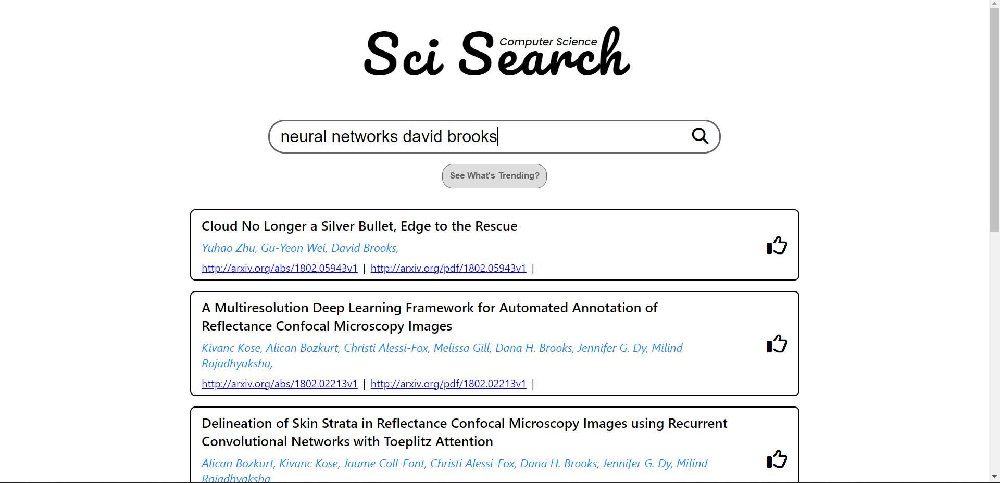
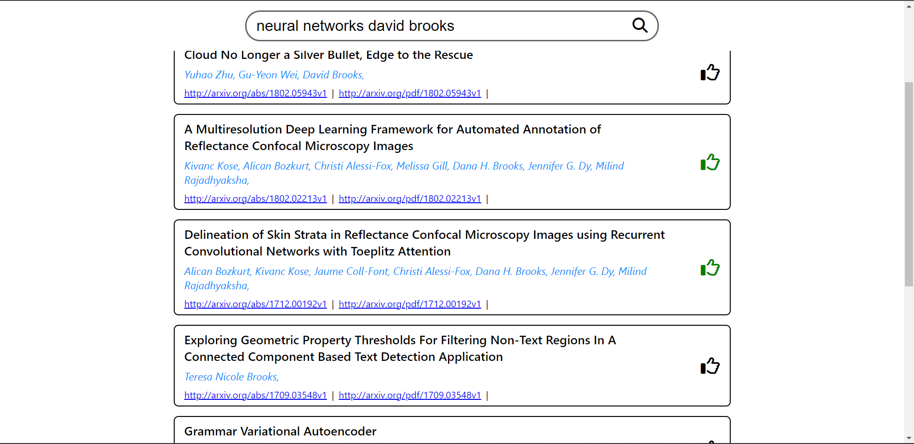
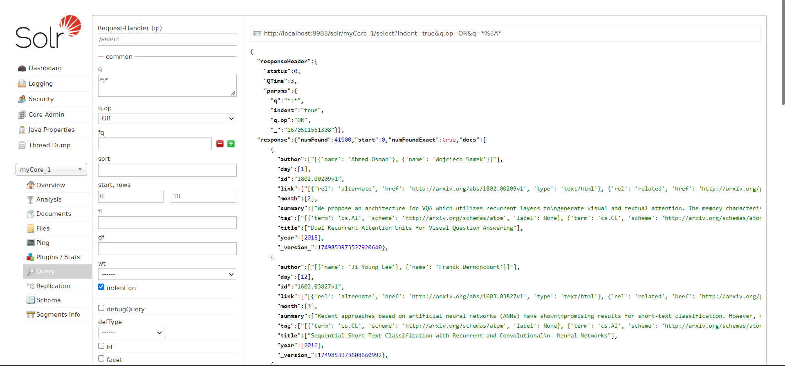
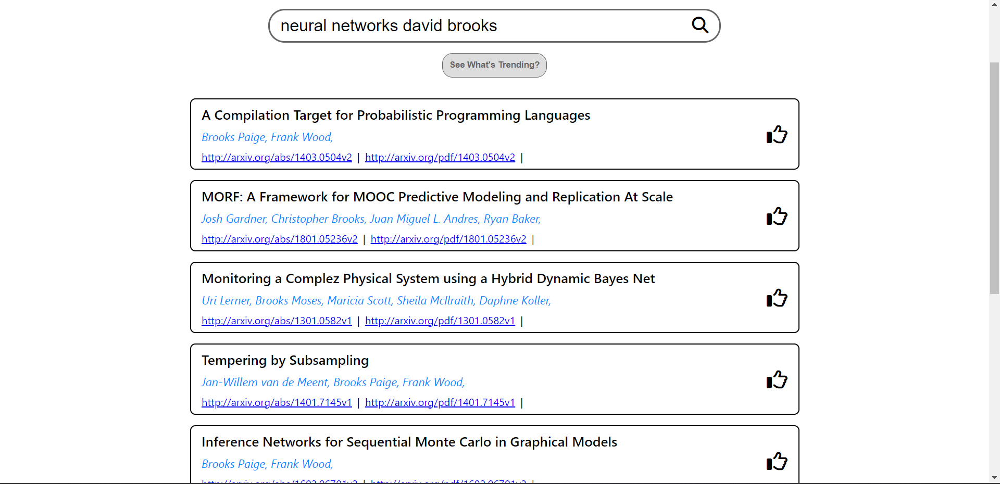
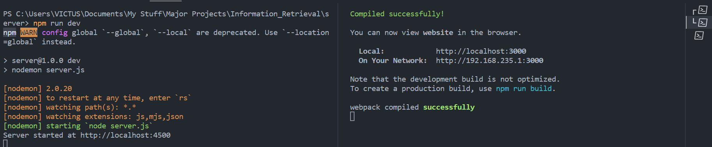

# Project : Scientific Document Retreival System

## Team Members -
* VARUN MUKHERJEE (S20200010224)
* SAKET RANJAN (S20200010185)

# About the Application
#### -> This project is an Information Retreival System(Search Engine) for Scientific documents
#### -> We are using a dataset of 41000 scientific documents (Arxiv dataset) , for Indexing Components

# Tech Stack Used
#### Frontend : React.Js
#### Backend : Node.Js
#### Indexing Component : Solr 

# Search Engine Interface

#### Search Engine


#### Relevance Feedback


#### Solr Interface


#### Trending Section


# How to Run the Application

1. Start the *Solr* server at `port: 8983`
2. Download Dataset from [Arxiv Dataset](https://drive.google.com/drive/folders/1Xo6T60xqrJWS5KD-iYRxYXc0QKH9jLuN?usp=share_link) & Upload the data in `Solr Server`
   
   Or

2. Create core & Upload the .json data `arxiv.json` in (`\Dataset` folder) in the `Solr Server`
4. Navigate to `\Server` in terminal, and write following commands
```bash
npm i
npm run dev
```
5. Naviate to `\Client` in terminal, and write following commands
```bash
npm i
npm start
```
#### Eg.

6. Now the server application is up and running 🥳